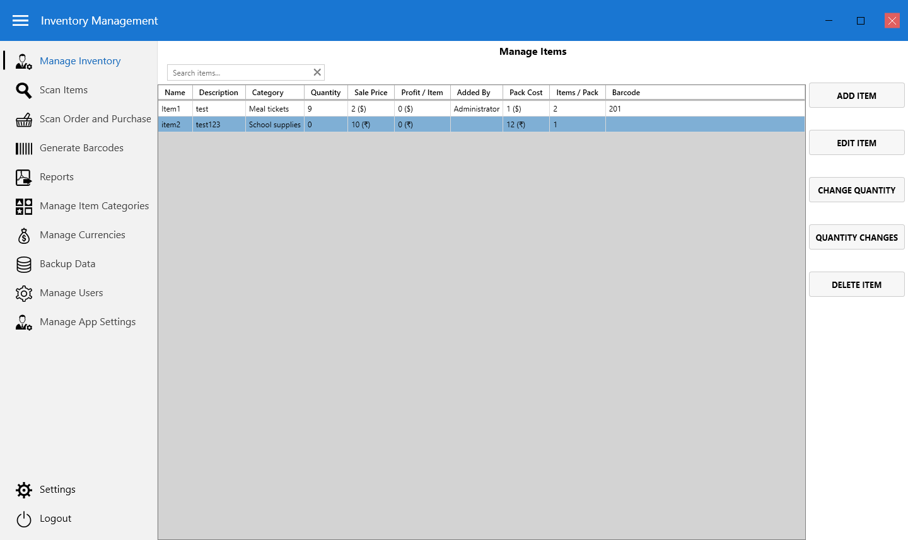
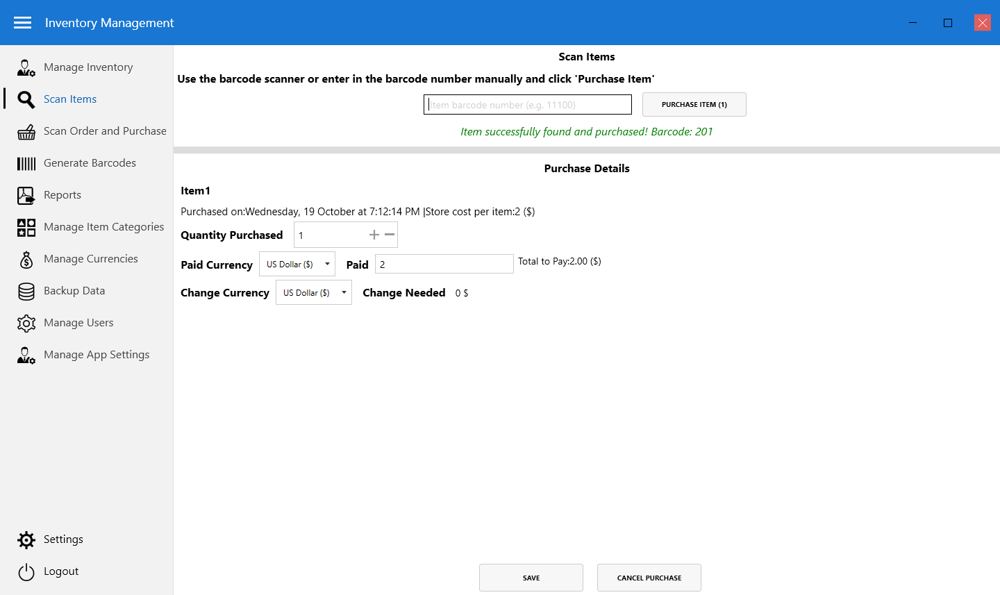
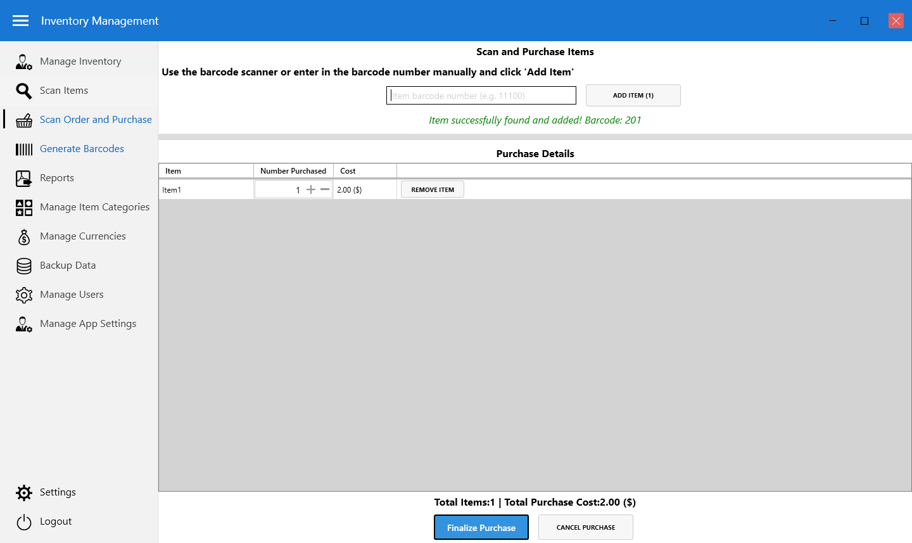
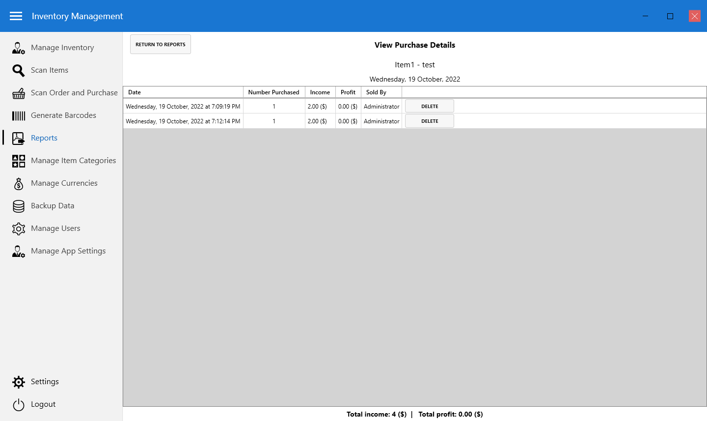
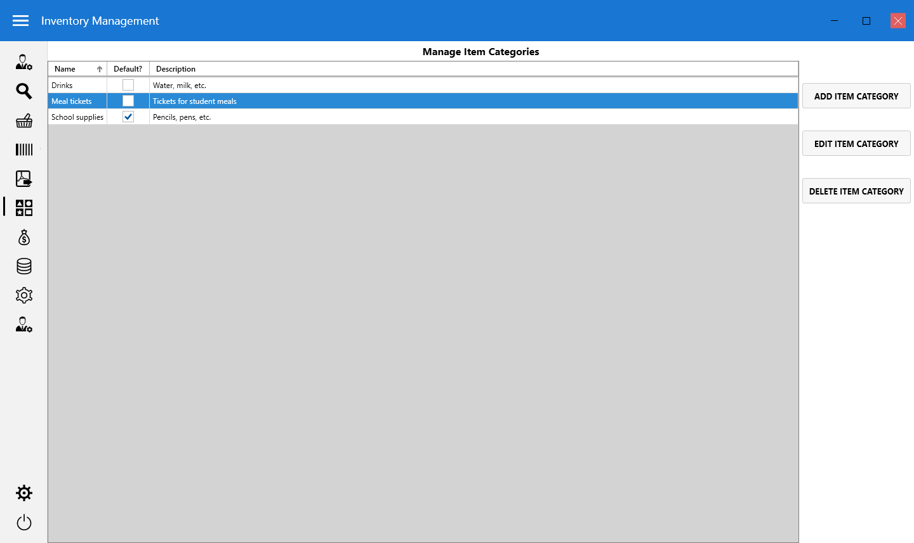

# InventoryManagement

InventoryManagement is a small Windows 7+ WPF software application to manage small inventories/stores where items are purchased on a regular basis. It runs on the .NET 4.7.1 framework and uses a SQLite database for data storage. InventoryManagement was built for a small school in Mondulkiri, Cambodia for use in the school store. Because of the school's location, Riel is the default currency, and A4 is the default paper size.

InventoryManagement can be edited in Visual Studio 2017+.

Feature set:

* Multiple users, each of which can be set with different permissions for the different software features available
* Manage your current inventory, including current stock/quantity
* Sort your inventory into different categories (drinks, school supplies, etc.) -- these different categories then show up as different subtotals on reports
* Scan items in using a barcode scanner to quickly mark single items as sold (1 item per purchase)
* An additional screen to scan multiple items in using a barcode scanner, then checkout/purchase all those items as one larger item (X items per purchase) -- this method allows you to also store limited amoutns of customer information
* When purchasing items, you can set the quantity purchased and amount paid, and the software calculates the amount of change you need to give -- including into different currencies
* Generate PDFs of barcodes to print out for use with your barcode scanner
* Run daily or weekly reports to see how much income you generated, how many items were sold, and how much profit you made
* Run inventory reports to see how much was in stock on any given date
* View details on when items were sold or when the quantity of an item was adjusted down to the second

## Default username and password

The default username is `admin`, and the default password is `admin`. Please change the password before you use this in real life!

## Screenshots

MIT License. Thanks for using the software!
